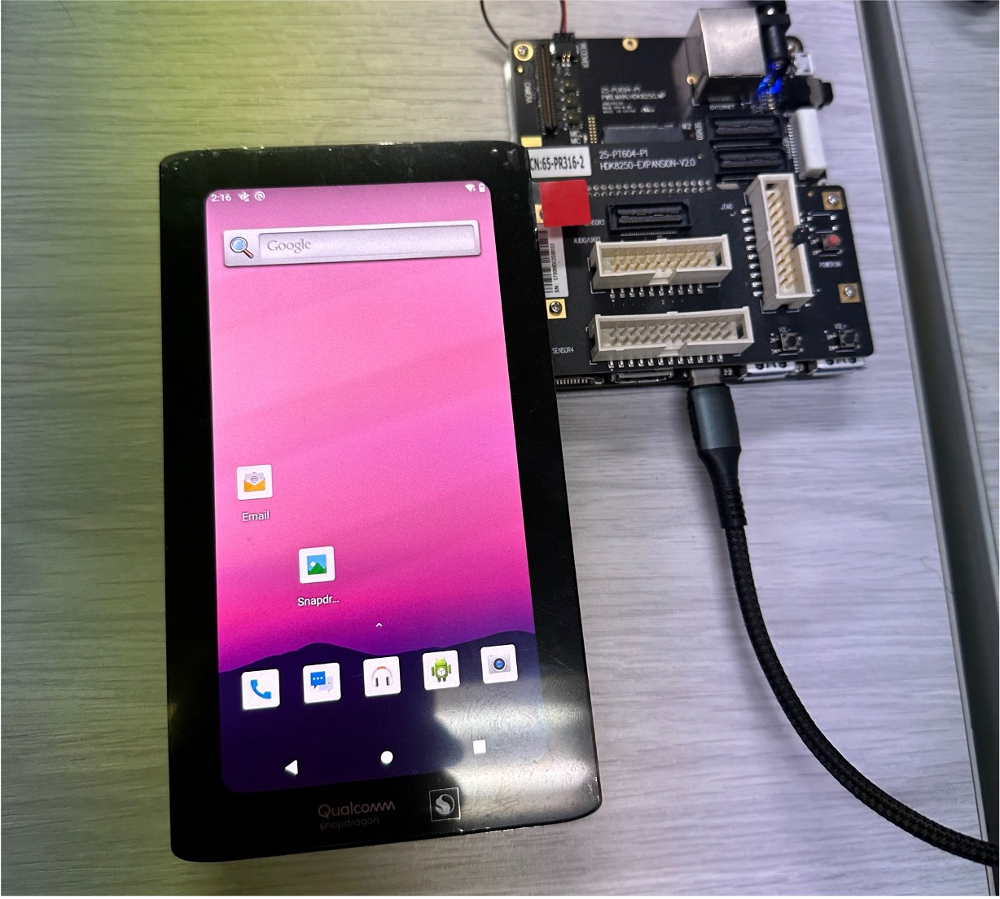
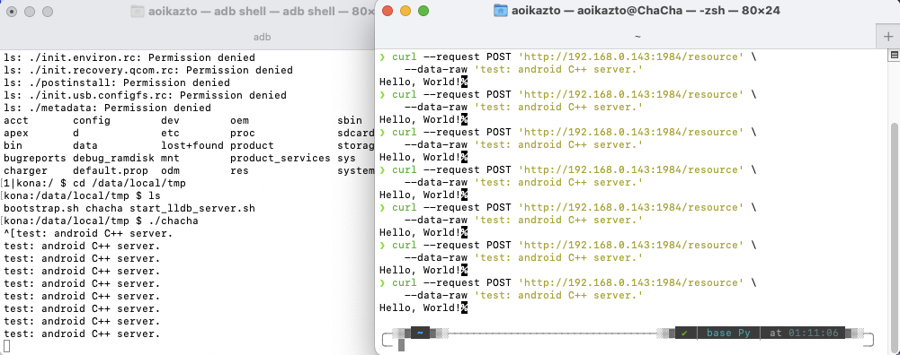
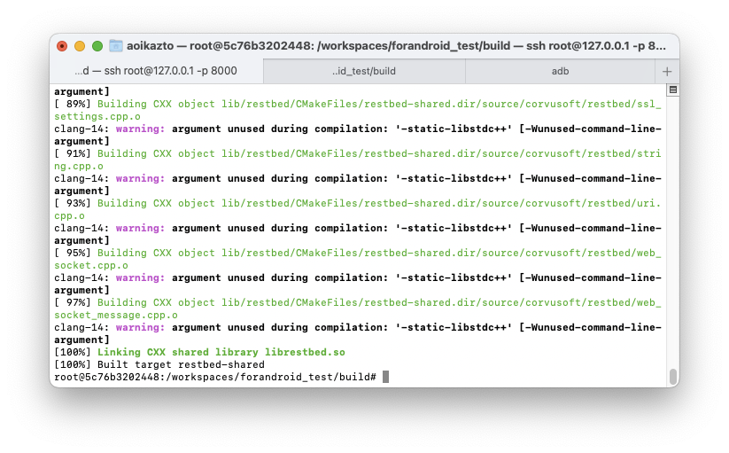

# Wow, Running Web Server In Android!!!!

This project is intended to record programs written in C++ on Android working normally. I used a simple web server to express how it works. We needed an example of a simple but different library as possible. So we implemented a web server using [[Restbed]](https://github.com/Corvusoft/restbed). Also note that the 1984 port is designated as the default port in the code. The actual equipment tested is [[Qualcomm Snapdragon 855 development kit equipment]](https://developer.qualcomm.com/hardware/snapdragon-855-hdk).

Build tests are conducted every Tuesday using the Crontab function in Github Action.

[](https://github.com/Piorosen/Restbed-based-Android-Web-Server/actions/workflows/build.yml)


---

HDK Server Result|
:---:|
|

## How to build? (For Android, In Linux)

```sh
$ git clone https://github.com/Piorosen/Restbed-based-Android-Web-Server
$ cd Restbed-based-Android-Web-Server
$ chmod +x bootstrap.sh
$ ./bootstrap.sh
$ make build
```

## How to push executable file into android (Using ADB, In Linux)

```sh
$ adb devices | grep device
# default value: ./build/chacha, because project name is chacha.
# adb push ${executable file: chacha} /data/local/tmp
$ adb push ./build/chacha /data/local/tmp
$ adb shell chmod +x /data/local/tmp/chacha
$ adb shell /data/local/tmp/chacha
```

## How to `Test`? (Using curl, In Linux)

```sh
$ curl --request POST 'http://{Android IP Address}:1984/resource' \
    --data-raw 'test: android C++ server.'
```

## Result

Server Result|Build
:---:|:---:
|
